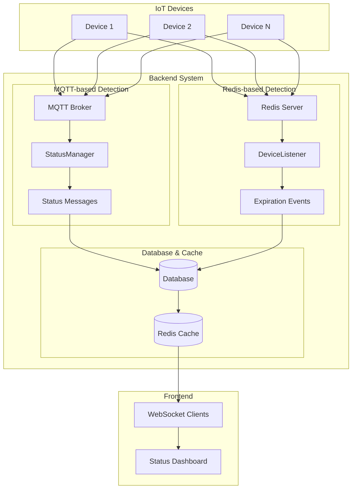
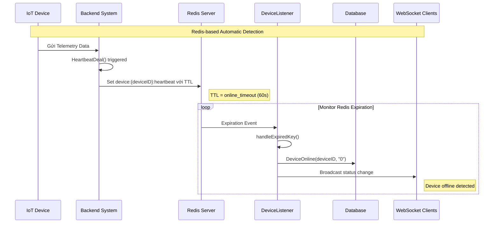
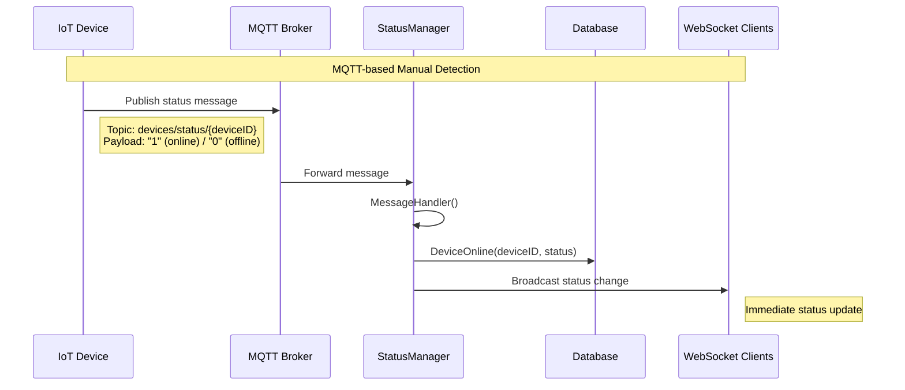
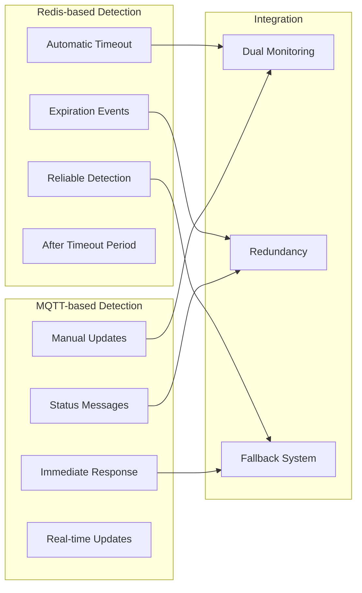
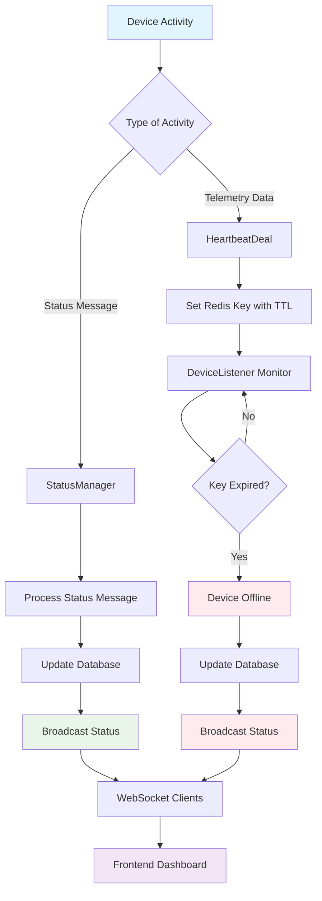
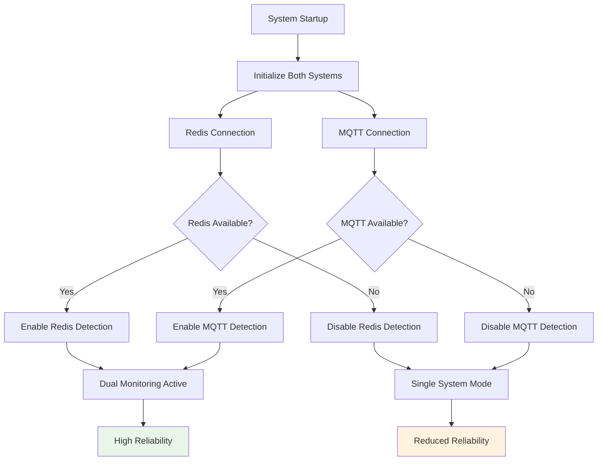

# Biểu đồ cơ chế phát hiện trạng thái thiết bị IoT

## Tổng quan hệ thống



## Chi tiết cơ chế Redis-based Detection



## Chi tiết cơ chế MQTT-based Detection



## So sánh hai cơ chế



## Workflow tổng hợp



## Cấu hình và tham số

```mermaid
graph TD
    subgraph "Redis Configuration"
        RC1[Database: 10]
        RC2[TTL: 60 seconds]
        RC3[Key Pattern: device:{deviceID}:heartbeat]
    end
    
    subgraph "MQTT Configuration"
        MC1[Broker: localhost:1883]
        MC2[Topic: devices/status/{deviceID}]
        MC3[QoS: 1]
    end
    
    subgraph "Device Configuration"
        DC1[online_timeout: 60]
        DC2[heartbeat: 30]
        DC3[status_report: manual]
    end
    
    subgraph "Performance Metrics"
        PM1[Memory Usage]
        PM2[CPU Usage]
        PM3[Network Latency]
        PM4[Detection Accuracy]
    end
    
    RC1 --> PM1
    MC1 --> PM3
    DC1 --> PM4
```

## Xử lý lỗi và fallback



## Kết luận

Hệ thống sử dụng **dual monitoring approach** với:

### **Redis-based Detection (Primary)**
- **Ưu điểm**: Tự động, đáng tin cậy, không phụ thuộc vào device
- **Nhược điểm**: Chỉ detect offline sau timeout
- **Use case**: Automatic offline detection

### **MQTT-based Detection (Secondary)**
- **Ưu điểm**: Real-time, immediate response
- **Nhược điểm**: Phụ thuộc vào device implementation
- **Use case**: Manual status updates, immediate changes

### **Integration Benefits**
- **Redundancy**: Cả hai system hoạt động song song
- **Reliability**: Fallback khi một system fails
- **Flexibility**: Hỗ trợ cả automatic và manual detection
- **Scalability**: Có thể scale từng system độc lập 